# ethereum-key-agreement

[](https://github.com/lbeder/ethereum-key-agreement/actions/workflows/workflow.yml)

A tool for various `secp2561k` key agreement protocols for Ethereum.

## Features

This project is created to ease **key exchange and agreement protocols** for Ethereum.

It should be used to generate a shared public and private key pair between adversarial counterparties, which can be used to open a secure communication channel or effectively act as a `2-out-of-2` multisig (whenever using an on-chain multisig smart contract or fully privacy-preserving MPC isn't applicable).

These protocols can be easily extended to `n-out-of-n` schemes and can also be used in a hierarchical key sharing way (e.g., a master shared key `M` is derived via a `2-out-of-2` combination of keys `a` and `b`, while both `a` and `b` are derived via additional `5-out-of-5` and `3-out-of-3` combinations respectively).

The project currently supports the following protocols:

- Proof of Possession
- Elliptic Curve Diffie–Hellman (ECDH) Key Agreement
- Key Aggregation Key Agreement

For your convenience, we have also provided the following tools to help you with public key extraction and address conversion:

- Convert a private key to a public key and an address
- Convert a public key to an address
- Extract a public key from a signed message (with or without an [EIP712](https://github.com/ethereum/EIPs/blob/master/EIPS/eip-712.md) prefix
- Extract a public key from a signed transaction and convert it to an address

**CAUTION:** We recommend running the tool in **offline mode** (e.g., on an air-gapped machine or without internet access), as plaintext private keys are being used. We have added an online/offline state detection widget just for that:

When you are online:

<p align="center">
    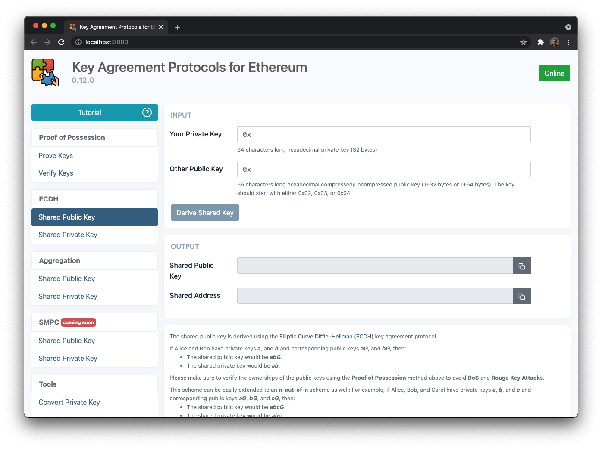
</p>

When you are offline:

<p align="center">
    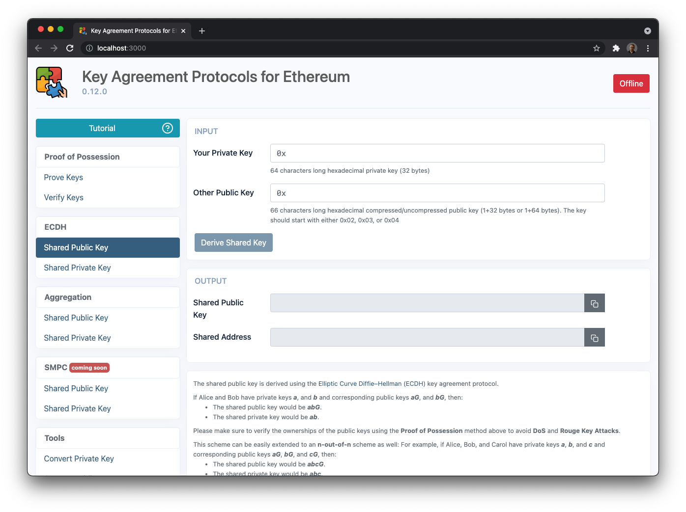
</p>

### Proof of Possession

**Proof of Possession** is an important technique of proving that a party sending a message owns a specific cryptographic key. This is used as a proof that the correct party is sending the message, under the assumption that only that sender has possession of the key. It is typically demonstrated by having the presenter/counterparty sign a value determined by the recipient using the key possessed by the presenter/counterparty.

In addition to preventing **human errors** or the counterparty from **DoS** the shared key by providing a key it doesn't possess, this is one of the possible mitigations against the **Rouge Key Attack**, where the counterparty will choose a specially crafted public key to either try to "cancel" your public key, during the shared key generation phase or to weaken its security.

As another complementary counter-measure for **Rouge Key Attack**, you can use a [Commit-Reveal](https://en.wikipedia.org/wiki/Commitment_scheme) scheme to split the exchange of the public keys into a **Commit** phase (e.g., providing a hash/[HMAC](https://en.wikipedia.org/wiki/HMAC) of the public keys) and a **Reveal** phase (providing the actual public keys and verifying that they conform to the previous commitments).

We recommend that:

- The message shouldn't have been chosen by the presenter/counterparty itself and should contain some data that is hard to determine ahead of time (e.g., some random data provided by you)
- The message should include a commitment to the actual public key (e.g., having the public key or its hash appear in its contents)
- The message should include a recent timestamp (to reduce key grinding attacks)

<p align="center">
    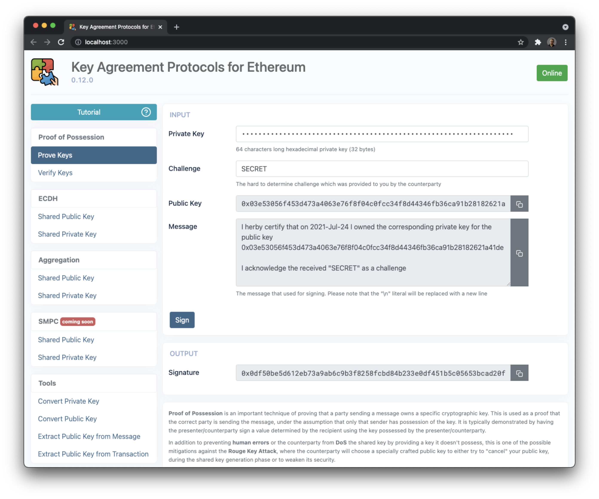
</p>

<p align="center">
    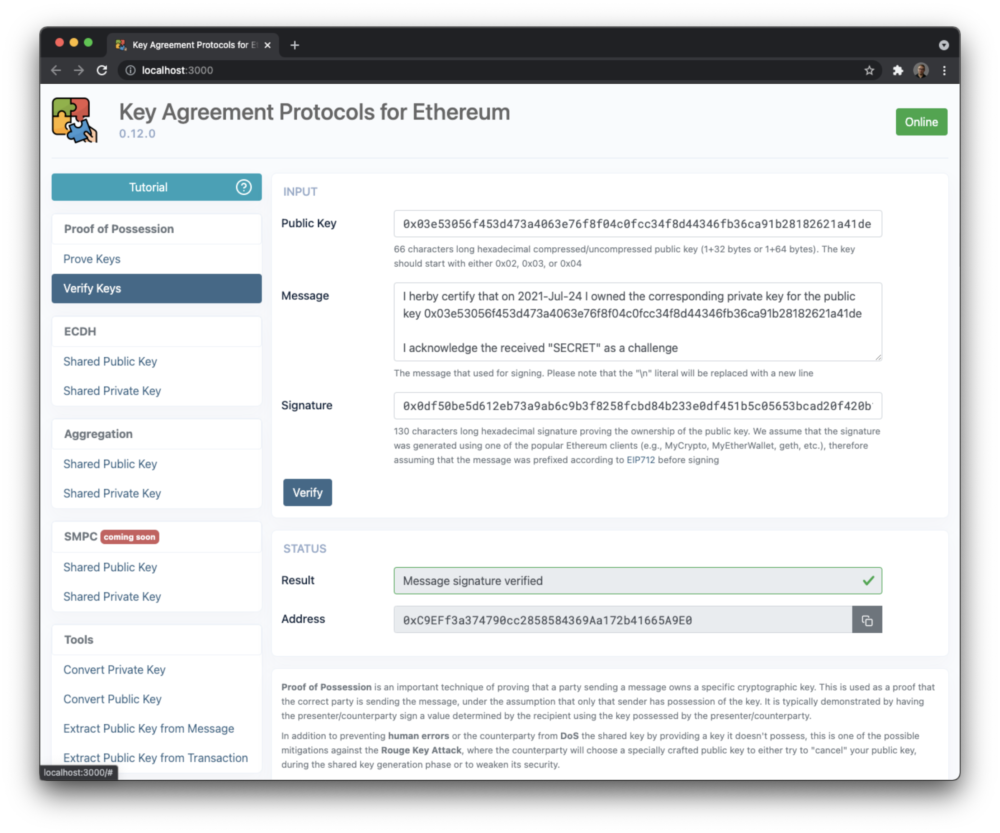
</p>

### Elliptic Curve Diffie–Hellman (ECDH)

The shared public key is derived using the [Elliptic Curve Diffie–Hellman (ECDH)](https://en.wikipedia.org/wiki/Elliptic Curve_Diffie%E2%80%93Hellman) key agreement protocol.

If Alice and Bob have private keys `a`, and `b` and corresponding public keys `aG`, and `bG`, then:

- The shared public key would be `abG`
- The shared private key would be `ab`

Please make sure to verify the ownerships of the public keys using the **Proof of Possession** method above to avoid **DoS** and **Rouge Key Attacks**.

This scheme can be easily extended to an `n-out-of-n` scheme as well:

For example, if Alice, Bob, and Carol have private keys `a`, `b`, and `c` and corresponding public keys `aG`, `bG`, and `cG`, then:

- The shared public key would be `abcG`.
- The shared private key would be `abc`.

Please be aware that if you are using a public key sourced from a hardware wallet, you will require your seed in order to recover your aggregated shared private key (by first extracting the relevant private key using a [BIP39](https://github.com/bitcoin/bips/blob/master/bip-0039.mediawiki) tool, preferably in a cold storage environment).

<p align="center">
    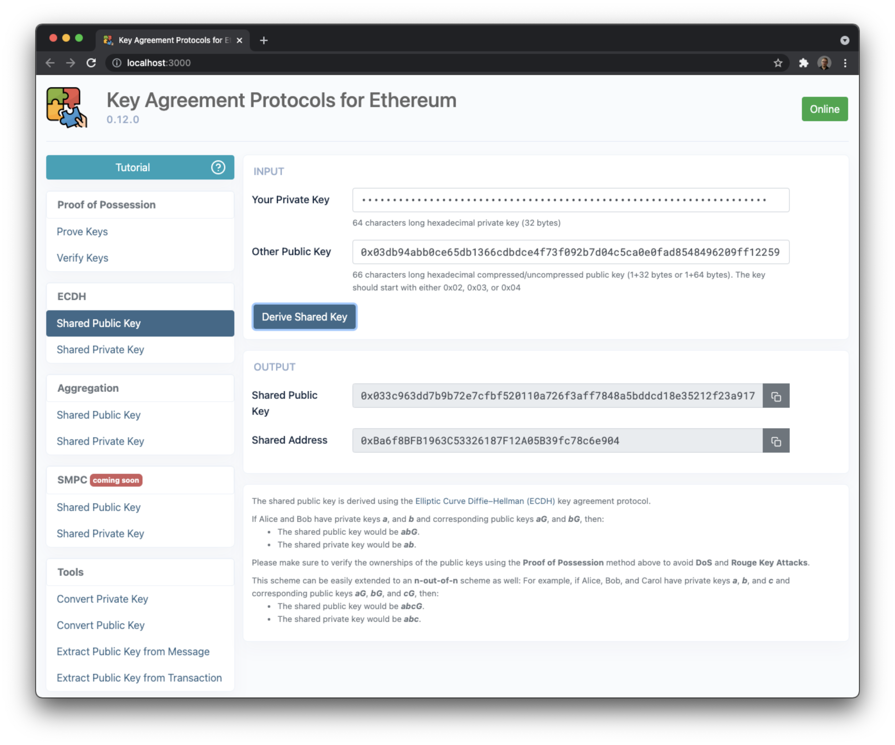
</p>

<p align="center">
    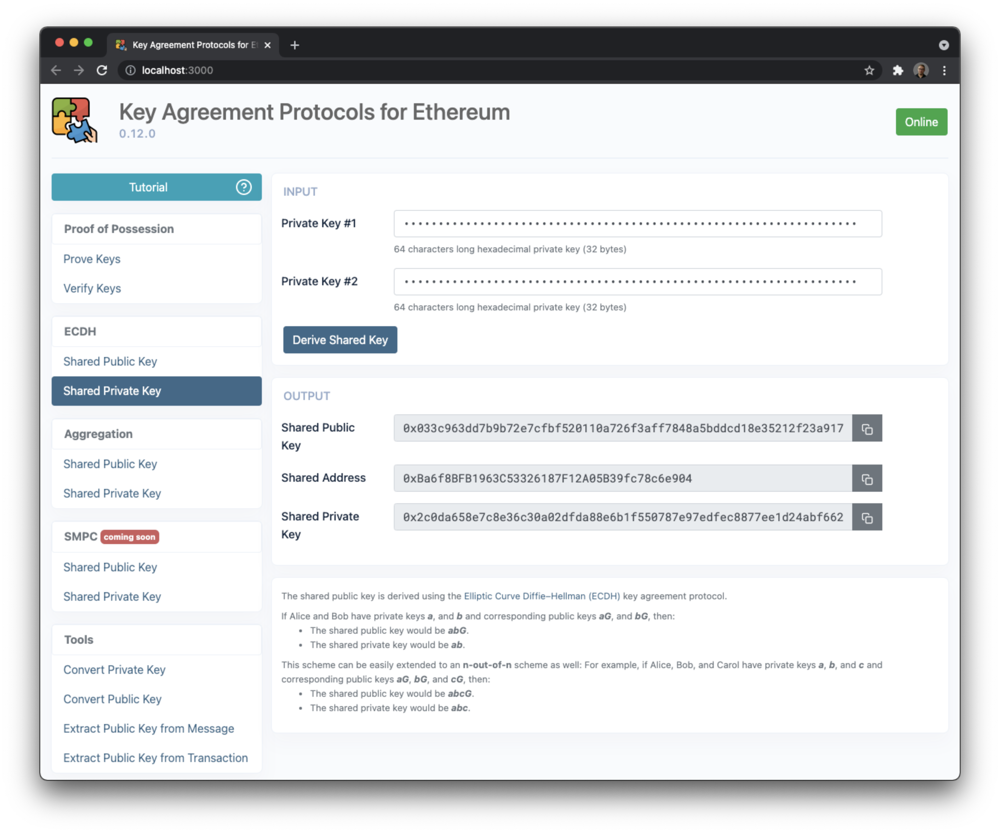
</p>

### Key Aggregation

The shared public key is derived using the key aggregation key agreement protocol.

If Alice and Bob have private keys `a`, and `b` and corresponding public keys `aG`, and `bG`, then:

- The shared public key would be `(a + b)G`
- The shared private key would be `a + b`

Please make sure to verify the ownerships of the public keys using the **Proof of Possession** method above to avoid **DoS** and **Rouge Key Attacks**.

This scheme can be easily extended to an `n-out-of-n` scheme as well:
For example, if Alice, Bob, and Carol have private keys `a`, `b`, and `c` and corresponding public keys `aG`, `bG`, and `cG`, then:

- The shared public key would be `(a + b + c)G`
- The shared private key would be `a + b + c`

Please be aware that if you are using a public key sourced from a hardware wallet, you will require your seed in order to recover your aggregated shared private key (by first extracting the relevant private key using a [BIP39](https://github.com/bitcoin/bips/blob/master/bip-0039.mediawiki) tool, preferably in a cold storage environment).

<p align="center">
    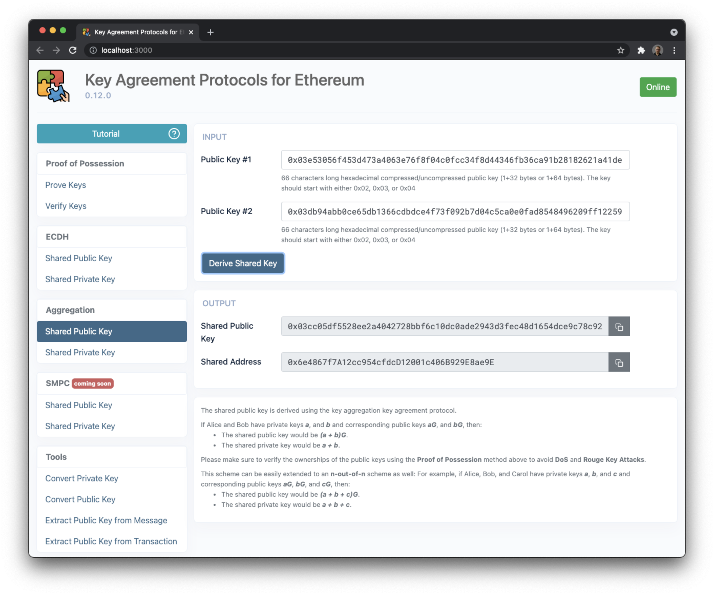
</p>

<p align="center">
    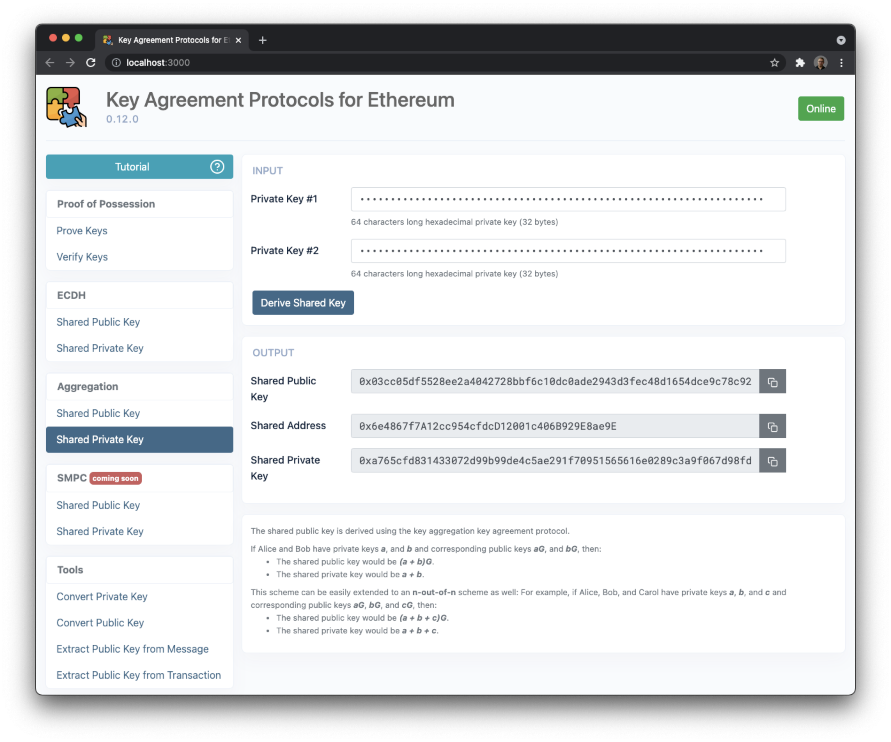
</p>

### Tools

#### Public Key and Address Extraction

For your convenience, we have also provided the following tools to help you with public key extraction and address conversion:

- Convert a private key to a public key and an address
- Convert a public key to an address

<p align="center">
    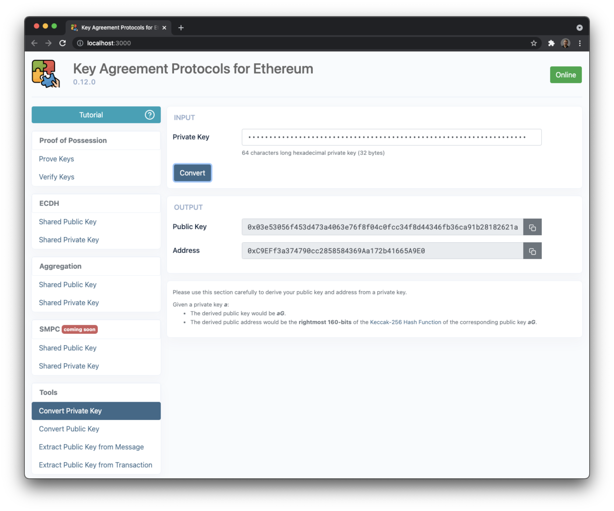
</p>

<p align="center">
    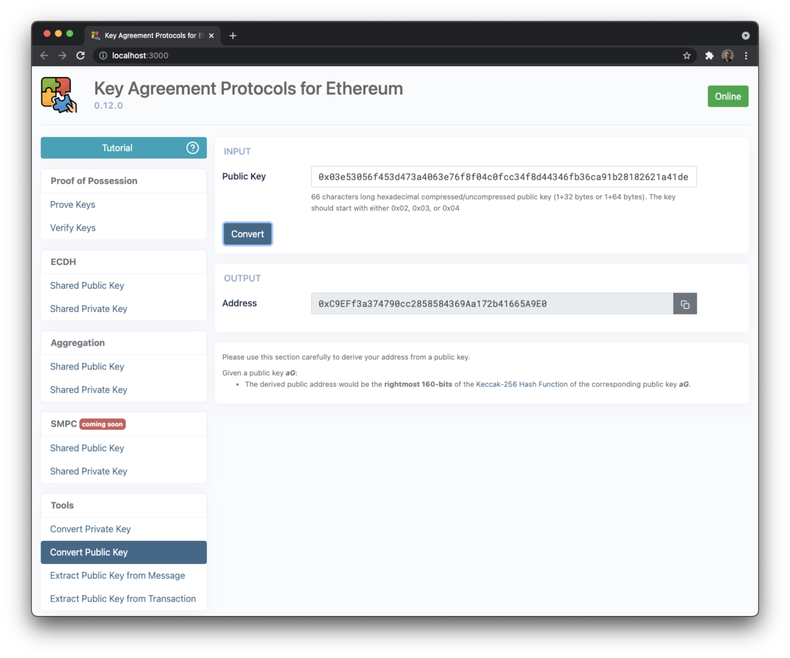
</p>

If you are using a hardware device such as a [Ledger](https://www.ledger.com/) or [Trezor](https://trezor.io/), or prefer not to input your private key into this app you may extract your public key and Ethereum address using one of the following methods:

- Extract a public key from a signed message (with or without an [EIP712](https://github.com/ethereum/EIPs/blob/master/EIPS/eip-712.md) prefix) and convert it to an address
- Extract a public key from a signed transaction and convert it to an address

<p align="center">
    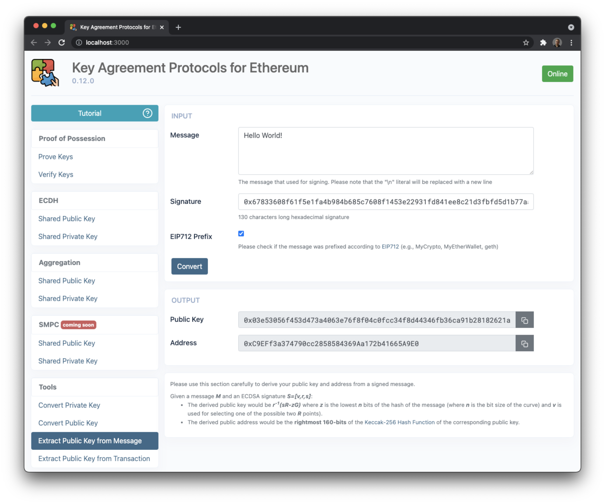
</p>

<p align="center">
    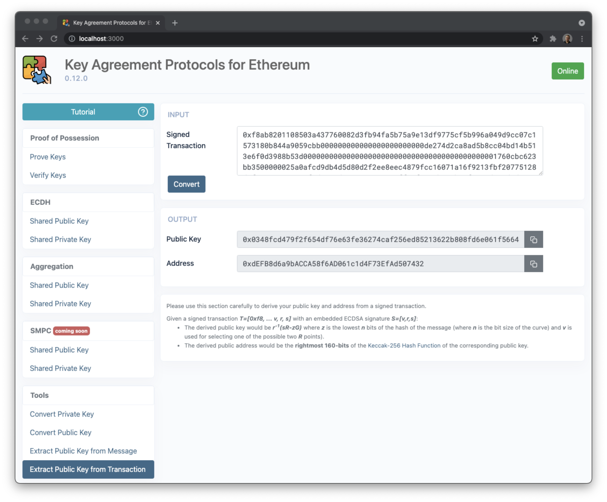
</p>

## Building

You can build the app for production to the `build` folder by running:

```bash
yarn build
```

It correctly bundles React in production mode and optimizes the build for the best performance.

The build is minified and the filenames include the hashes.

## Running

You can run he app in the development mode by running:

```bash
yarn start
```

Open [http://localhost:3000](http://localhost:3000) to view it in the browser.

## Testing

You can launch the test runner in the interactive watch mode by running:

```bash
yarn test
```

See the section about [running tests](https://facebook.github.io/create-react-app/docs/running-tests) for more information.

## Linting

You can lint the whole project by running:

```bash
yarn lint
```

## License

MIT License

Copyright (c) 2020 Leonid Beder

Permission is hereby granted, free of charge, to any person obtaining a copy
of this software and associated documentation files (the "Software"), to deal
in the Software without restriction, including without limitation the rights
to use, copy, modify, merge, publish, distribute, sublicense, and/or sell
copies of the Software, and to permit persons to whom the Software is
furnished to do so, subject to the following conditions:

The above copyright notice and this permission notice shall be included in all
copies or substantial portions of the Software.

THE SOFTWARE IS PROVIDED "AS IS", WITHOUT WARRANTY OF ANY KIND, EXPRESS OR
IMPLIED, INCLUDING BUT NOT LIMITED TO THE WARRANTIES OF MERCHANTABILITY,
FITNESS FOR A PARTICULAR PURPOSE AND NON-INFRINGEMENT. IN NO EVENT SHALL THE
AUTHORS OR COPYRIGHT HOLDERS BE LIABLE FOR ANY CLAIM, DAMAGES OR OTHER
LIABILITY, WHETHER IN AN ACTION OF CONTRACT, TORT OR OTHERWISE, ARISING FROM,
OUT OF OR IN CONNECTION WITH THE SOFTWARE OR THE USE OR OTHER DEALINGS IN THE
SOFTWARE.
